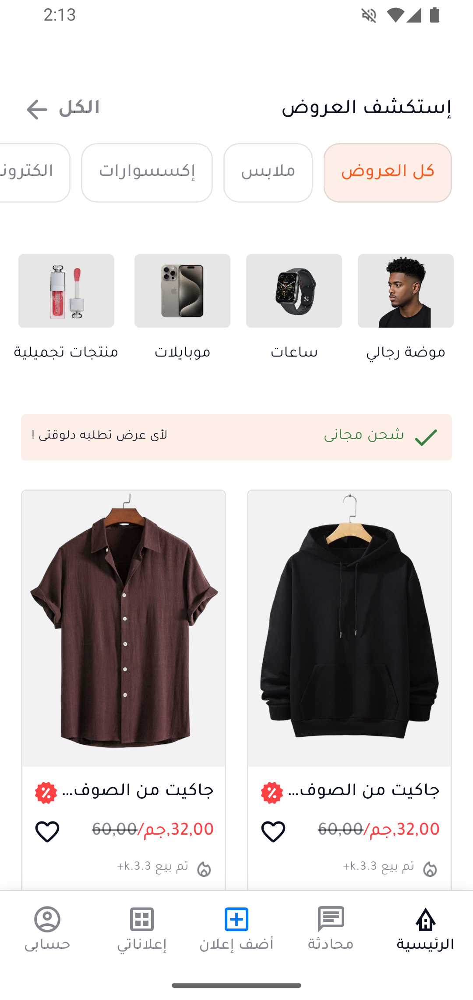
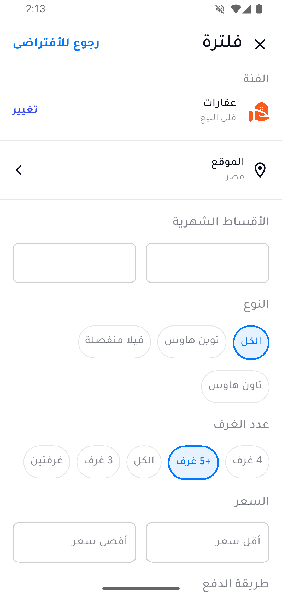
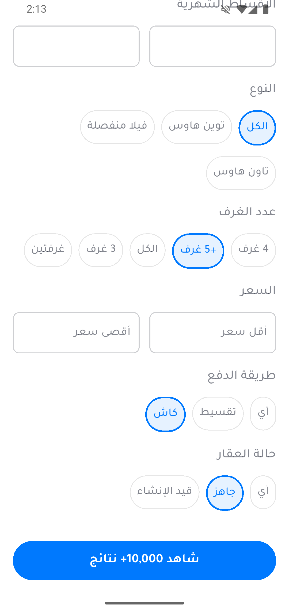
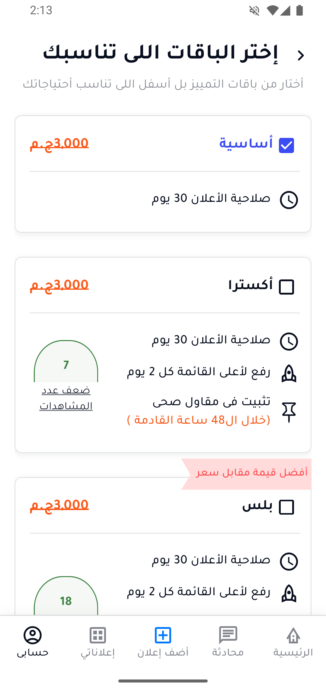
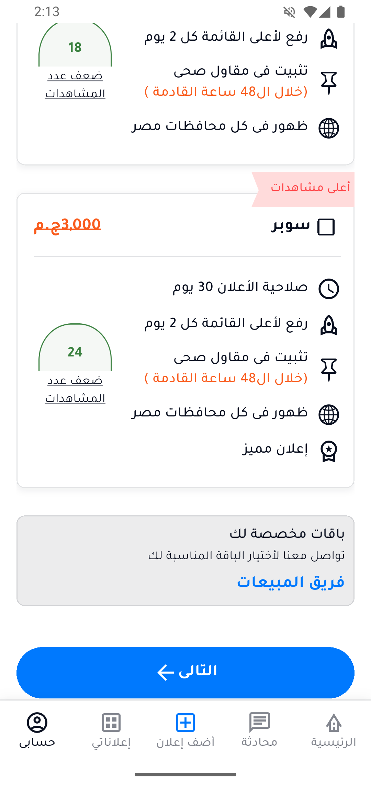

# 🛍️ Flutter E-Commerce Application

<div align="center">


**A comprehensive Flutter e-commerce application with advanced filtering and local data persistence**

</div>

---

## 📸 Screenshots

<div align="center">
  <h2>📱 App Screenshots</h2>
  
  <table>
    <tr>
      <th colspan="3">Main Screens</th>
    </tr>
    <tr>
      <td align="center"><strong>🏠 Home Screen</strong></td>
      <td align="center"><strong>🔍 Filter Page</strong></td>
      <td align="center"><strong>📋 Plans Page</strong></td>
    </tr>
    <tr>
      <td align="center"></td>
      <td align="center"></td>
      <td align="center"></td>
    </tr>
    <tr>
      <td colspan="3" height="20"></td>
    </tr>
    <tr>
      <th colspan="3">Additional Screens</th>
    </tr>
    <tr>
      <td align="center"></td>
      <td align="center"></td>
    </tr>
  </table>

  <br>
  
  <div style="background: linear-gradient(135deg, #667eea 0%, #764ba2 100%); padding: 20px; border-radius: 10px; color: white; margin: 20px 0;">
    <h3>🎯 Key Features Showcase</h3>
    <p>Modern UI • Arabic RTL Support • Advanced Filtering • Responsive Design</p>
  </div>
</div>

> **Note:** All screenshots are available in the [`/screenshots`](./screenshots) folder

---

## 📋 Overview

A comprehensive Flutter e-commerce application built with focus on:
- **Design Accuracy:** 100% adherence to all design specifications
- **Performance:** Local database integration for seamless experience
- **Code Quality:** Clean, organized, and professional code following best practices

## ✨ Key Features

### 🎨 User Interface
- ✅ **100% Design Compliance** - Pixel-perfect implementation
  - Exact Color Codes
  - Precise Font Sizes
  - Tajwal Font Family (all weights)
  - Original Icons and Symbols
  - Accurate Paddings and Margins
- 🌙 Full Arabic support with RTL layout
- 📱 Responsive design for all screen sizes
- 🎯 Smooth and intuitive user experience

### 🔍 Advanced Filtering System
- Building type (Villa, Town House, Twin House)
- Number of rooms
- Price range (minimum and maximum)
- Payment method (Cash, Installments)
- Building status (Ready, Under Construction)
- Monthly installments
- Geographic location

### 📋 Subscription Plans
- **4 Premium Plans** - Basic, Extra, Plus, Super
- **Plan Selection** - Choose and save preferred plan
- **Feature Comparison** - Visual comparison of plan benefits
- **Persistent Selection** - Saved plan persists across app sessions
- **Dynamic Features:**
  - Ad validity (30 days)
  - Top of list promotion
  - Featured ads
  - Location-based visibility
  - View multipliers

### 💾 Local Database
- **SQLite** for permanent data storage
- Optimized database structure
- Persistent plan selection storage

## 🗄️ SQLite Database Structure

### Products Table
```sql
CREATE TABLE products (
  productId TEXT PRIMARY KEY,
  productName TEXT NOT NULL,
  imageUrl TEXT NOT NULL,
  price TEXT NOT NULL,
  discountPrice TEXT,
  salesCount TEXT,
  categoryId INTEGER,
  buildingType TEXT,
  roomsCount INTEGER,
  paymentMethod TEXT,
  buildingStatus TEXT,
  location TEXT,
  monthlyInstallment TEXT,
  createdAt TIMESTAMP DEFAULT CURRENT_TIMESTAMP
);

-- Indexes for fast searching
CREATE INDEX idx_category ON products(categoryId);
CREATE INDEX idx_price ON products(price);
CREATE INDEX idx_building_type ON products(buildingType);
```

### Categories Table
```sql
CREATE TABLE categories (
  id INTEGER PRIMARY KEY AUTOINCREMENT,
  name TEXT NOT NULL,
  iconUrl TEXT,
  isActive INTEGER DEFAULT 1
);
```

### Selected Plans Table
```sql
CREATE TABLE selected_plan (
  id INTEGER PRIMARY KEY AUTOINCREMENT,
  planId TEXT NOT NULL UNIQUE,
  userId TEXT,
  selectedAt TIMESTAMP DEFAULT CURRENT_TIMESTAMP,
  updatedAt TIMESTAMP DEFAULT CURRENT_TIMESTAMP
);

-- Trigger to update timestamp on plan change
CREATE TRIGGER update_plan_timestamp 
AFTER UPDATE ON selected_plan
BEGIN
  UPDATE selected_plan 
  SET updatedAt = CURRENT_TIMESTAMP 
  WHERE id = NEW.id;
END;
```

### Plans Table
```sql
CREATE TABLE plans (
  planId TEXT PRIMARY KEY,
  planTitle TEXT NOT NULL,
  price TEXT NOT NULL,
  advValidity BOOLEAN DEFAULT 0,
  topOfTheList BOOLEAN DEFAULT 0,
  sanitaryContractor BOOLEAN DEFAULT 0,
  inAllEgypt BOOLEAN DEFAULT 0,
  featuredAd BOOLEAN DEFAULT 0,
  inJahra BOOLEAN DEFAULT 0,
  havePlanOffer BOOLEAN DEFAULT 0,
  badgeTitle TEXT,
  numberOfViews TEXT,
  displayOrder INTEGER,
  isActive BOOLEAN DEFAULT 1
);
```

## 🏗️ Architecture

```
lib/
├── 📱 main.dart
├── 🎨 core/
│   ├── constants/
│   │   ├── app_colors.dart        # Complete color system
│   │   └── app_text_styles.dart   # Text styles (Tajwal)
│   ├── shared/
│   │   └── widgets/               # Reusable components
│   └── database/
│       └── app_database_helper.dart
├── 🔧 features/
│   ├── home/
│   │   ├── 📊 data/
│   │   │   ├── models/           # Data models
│   │   │   ├── datasources/      # Local data sources
│   │   │   └── repositories/     # Repository implementations
│   │   ├── 💼 domain/
│   │   │   ├── entities/         # Core entities
│   │   │   └── repositories/     # Repository interfaces
│   │   └── 🎨 presentation/
│   │       ├── pages/            # Screen pages
│   │       ├── widgets/          # UI components
│   │       └── cubit/            # State management
│   ├── filter/
│   │   └── [same structure]
│   └── profile/
│       ├── 📊 data/
│       ├── 💼 domain/
│       └── 🎨 presentation/
│           ├── pages/
│           │   └── plans_page.dart
│           ├── widgets/
│           │   ├── plans/
│           │   │   └── plan_card_widget.dart
│           │   └── appBar_title/
│           └── bloc/
│               └── cubit/
│                   ├── plans_cubit.dart
│                   └── plans_state.dart
└── 📦 assets/
    ├── images/
    ├── fonts/
    └── svg/
```

## 🛠️ Tech Stack

| Technology | Version | Purpose |
|-----------|---------|---------|
| **Flutter** | ^3.8.1 | Core framework |
| **flutter_bloc** | ^9.1.1 | State management |
| **sqflite** | ^2.4.2 | Local database |
| **flutter_screenutil** | ^5.9.3 | Responsive design |
| **flutter_svg** | ^2.2.1 | SVG image support |
| **iconify_flutter** | ^0.0.7 | Icon library |

## 🚀 Installation & Setup

### Prerequisites
- Flutter SDK 3.8.1 or higher
- Dart SDK 3.0+
- Android Studio or VS Code
- Emulator or physical device

### Setup Steps
```bash
# 1. Clone the repository
git clone https://github.com/yourusername/flutter-task-ammar-alkady.git

# 2. Navigate to project directory
cd flutter-task-ammar-alkady

# 3. Install dependencies
flutter pub get

# 4. Run the application
flutter run
```

## 🎨 Design System

### Colors
```dart
primaryColor: #FF6B35
secondaryColor: #F7931E
backgroundColor: #FFFFFF
textColor: #2D3142
accentColor: #4ECDC4
```

### Typography
- **Font Family:** Tajwal (Google Fonts)
- **Weights:** 200, 300, 400, 500, 700, 800, 900

## 📁 Mock Data

The application includes comprehensive mock data:
- ✅ 8 main categories
- ✅ High-quality images
- ✅ Realistic prices and discounts

## 🎯 Feature Modules

### Home Feature
- `OffersPage`: Main products page
- `HomeCubit`: Product and category state management
- `HomeLocalDataSource`: Mock data provider
- `ProductItem`: Individual product card widget
- `CategoriesWidget`: Category selection interface

### Filter Feature
- `FilterPage`: Comprehensive filtering interface
- `FilterCubit`: Filter state management
- Various filter widgets (Price, Location, Installments, etc.)

### Profile Feature
- `PlansPage`: Subscription plans display and selection
- `PlansCubit`: Plans state management and persistence
- `PlanCardWidget`: Individual plan card with features
- **Plan Features:**
  - Basic Plan: 30-day ad validity
  - Extra Plan: Top of list every 2 days + 7x views
  - Plus Plan: All Egypt visibility + 18x views
  - Super Plan: Featured ads + multiple locations + 24x views
- **Custom Plans:** Contact support section
- Persistent selection stored in SQLite

## 📊 Evaluation Criteria

### ✅ Design Implementation
- 100% color accuracy
- Correct fonts (Tajwal)
- Precise text sizes
- Original icons
- Accurate spacing and margins
- No substitute elements used

### ✅ Code Organization
- Clean Architecture
- Clear file and class naming
- Organized folder structure
- Separation of concerns
- Clean and maintainable code

### ✅ SQLite Database
- Optimized database structure

### ✅ State Management
- Cubit implementation
- All states handled
- Business logic separation
- Reactive UI updates

### ✅ Documentation
- Comprehensive README
- Clear screenshots
- Tools explanation
- Installation instructions

## 📂 Project Structure

```
flutter-task-ammar-alkady/
├── 📸 screenshots/              # Application screenshots
│   ├── home_screen.png
│   ├── filter_screen.png
│   ├── categories.png
│   └── ...
├── 📱 lib/
│   ├── main.dart
│   ├── core/
│   └── features/
├── 📦 assets/
│   ├── images/
│   ├── fonts/
│   └── svg/
├── 📄 README.md
├── 📋 pubspec.yaml
```

## 🎯 Challenges & Solutions

### Challenge 1: Design Accuracy
**Solution:** Used `flutter_screenutil` with precise measurements to ensure 100% design match

### Challenge 2: Complex Filtering
**Solution:** Built scalable filtering system with proper state management

### Challenge 3: Plan Selection Persistence
**Solution:** Integrated SQLite with BLoC for seamless state persistence across app sessions

## 👨‍💻 Developer

**Ammar Alkady**  
Flutter Developer

📧 Email: ammaralkady49@gmail.com  
💼 LinkedIn: [https://www.linkedin.com/in/ammar-alkady-97417b273/](#)  
🐙 GitHub: [https://github.com/AmmarAlkady49](#)


<div align="center">

**Built with ❤️ using Flutter**

⭐ If you like this project, don't forget to give it a star!

</div>